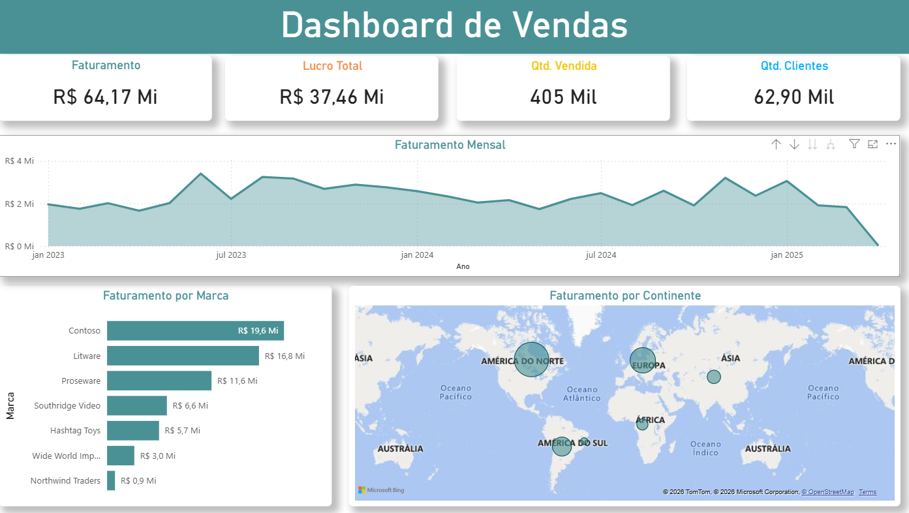

# 📊 Dashboard de Vendas - Global Performance

Este repositório contém um projeto completo de análise de dados, desde a base bruta até a visualização final no Power BI. O objetivo é monitorar KPIs de vendas, faturamento e lucratividade por região e marca.

## 📂 Arquivos no Repositório
* **`Projeto vendas.pbix`**: Arquivo original do Power BI.
* **`Vendas.xlsx`**: Planilha utilizada como fonte de dados.
* **`Dashboard Vendas 2.txt`**: Meu guia pessoal com o passo a passo do processo de ETL e criação.
* **`Projeto vendas.pdf`**: Projeto funcional realizado e exportado para PDF.

## 🛠️ O que foi desenvolvido
1. **ETL (Extração, Transformação e Carga)**: Realizei a limpeza dos dados e tipagem das colunas no Power Query.
2. **Modelagem de Dados**: Estruturação das tabelas e criação de relacionamentos.
3. **DAX**: Criação de medidas para Faturamento, Lucro Total e Quantidade Vendida.
4. **Visualização**: Design de dashboard com foco em experiência do usuário (UX), incluindo mapas e filtros interativos.

## 🚀 Como visualizar
1. Baixe o arquivo `.pbix`.
2. Certifique-se de ter o **Power BI Desktop** instalado.
3. (Opcional) Veja as métricas principais na imagem de preview abaixo:

---
✉️ **Contato:** [www.linkedin.com/in/gabriel-nascimento-dantas/]
